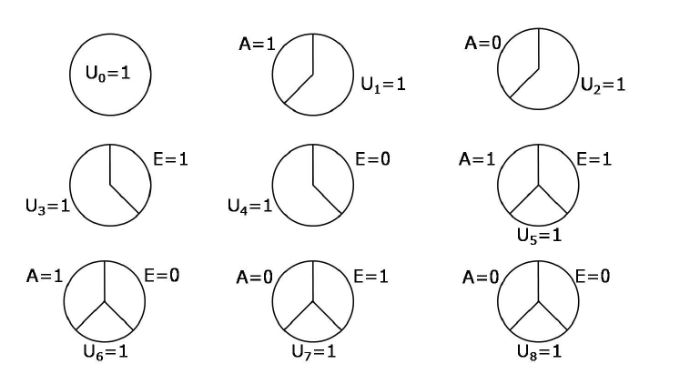

# 5. Interaction {-}

## 5.1 Interaction requires a joint intervention {-}

- We refer to interventions on two or more treatments as joint interventions.
- We say that there is interaction between $A$ and $E$ on the additive scale in the population if 
$$P(Y^{a=1, e=1}=1)-P(Y^{a=0, e=1}=1)\ne P(Y^{a=1, e=0}=1)-P(Y^{a=0, e=0}=1).$$
This is equivalent to 
$$P(Y^{a=1, e=1}=1)-P(Y^{a=1, e=0}=1)\ne P(Y^{a=0, e=1}=1)-P(Y^{a=0, e=0}=1).$$

- Difference between interaction and effect modification: a variable $V$ is a modifier of the effect of $A$ on $Y$ when the average causal effect of $A$ on $Y$ varies across levels of $V$. Note the concept of effect modification
refers to the causal effect of $A$, not to the causal effect of $V$. In contrast, the definition of interaction between $A$ and $E$ gives equal status to both treatments $A$ and $E$. The concept of interaction refers to the joint causal effect of two treatments $A$ and $E$, and thus involves the counterfactual outcomes $Y^{a, e}$ under a joint intervention. 

## 5.2 Identifying interaction {-}

Consider two cases:

- Suppose $E$ were randomly, and unconditionally, assigned by the investigators. Then we have 
$$P(Y^{a=1, e=1}=1)=P(Y^{a=1}=1|E=1)$$. 
Using a similar argument, we can rewrite the definition of interaction between $A$ and $E$ on the additive scale as 
$$P(Y^{a=1}=1|E=1)-P(Y^{a=0}=1|E=1)\ne P(Y^{a=1}=1|E=0)-P(Y^{a=0}=1|E=0).$$
This is exactly the definition of modification of the effect of $A$ by $E$ on the additive scale. In the other words, when treatment $E$ is randomly assigned, then the concepts of interaction and effect modification coincide. 
- Suppose treatment $E$ was not assigned by investigators. To assess the presence of interaction between $A$ and $E$, we need to compute the four marginal risks $P(Y^{a, e}=1)$. An equivalent way of conceptualizing this problem follows: rather than viewing $A$ and $E$ as two distinct treatments with two possible levels (1 or 0) each, one can view $AE$ as a combined treatment with four possible levels $(11, 01, 10, 00)$. Under this conceptualization the identification of interaction between two treatments is not different from the identification of the causal effect of one treatment. 

## 5.3 Counterfactual response types and interaction {-}

| Type | a=1, e=1 | a=0, e=1 | a=1, e=0 | a=0, e=0 |
|:----:|:--------:|:--------:|:--------:|:--------:|
|   1  |     1    |     1    |     1    |     1    |
|   2  |     1    |     1    |     1    |     0    |
|   3  |     1    |     1    |     0    |     1    |
|   4  |     1    |     1    |     0    |     0    |
|   5  |     1    |     0    |     1    |     1    |
|   6  |     1    |     0    |     1    |     0    |
|   7  |     1    |     0    |     0    |     1    |
|   8  |     1    |     0    |     0    |     0    |
|   9  |     0    |     1    |     1    |     1    |
|  10  |     0    |     1    |     1    |     0    |
|  11  |     0    |     1    |     0    |     1    |
|  12  |     0    |     1    |     0    |     0    |
|  13  |     0    |     0    |     1    |     1    |
|  14  |     0    |     0    |     1    |     0    |
|  15  |     0    |     0    |     0    |     1    |
|  16  |     0    |     0    |     0    |     0    |

- Each cell in the above table is $Y^{a, e}$ for each $a, e$ value. 
- Type 1, 4, 6, 11, 13, 16: for an invididual with one of these response types, the causal effect of treatment $A$ on the outcome $Y$ is the same regardless of the value of treatment $E$. Therefore, in a population in which every individual has one of these 6 response types,
$$P(Y^{a=1, e=1}=1)-P(Y^{a=0, e=1}=1)=P(Y^{a=1, e=0}=1)-P(Y^{a=0, e=0}=1).$$
That is, if all individuals in the population have responses 1, 4, 6, 11, 13 and 16, then there will be no interaction between $A$ and $E$ on the additive scale. 

- The presence of additive interaction between $A$ and $E$ implies that there must be individuals in at least one of the other remaining response types. 

## 5.4 Sufficient causes {-}

- Sufficient-component causes 
- 9 possible sufficient-component causes for a dichotomous outcome and two treatments: 

## 5.5 Sufficient cause interaction {-}

- The definition of interaction within the counterfactual framework does not require any knowledge about those mechanisms nor even that the treatments work together. 

- Another concept of interaction is not based on counterfactual contrasts but rather on sufficient-component causes. Therefore, it is called interaction within the sufficient-component-cause framework, or for brevity, sufficient cause interaction. 

- A sufficient cause interaction between $A$ and $E$ exists in the population if $A$ and $E$ occur together in a sufficient cause. For example, suppose individuals with background factors $U_5=1$ will develop the outcome when jointly receiving $E=1$ and $A=1$, but not when receiving only one of the two treatments. Then a sufficient cause interaction between $A$ and $E$ exists if there exists an individual with $U_5=1$. 

## 5.6 Counterfactuals or sufficient-component causes? {-}

- The sufficient component cause model considers sets of actions, events, or states of nature which together inevitably bring about the outcome under consideration. The model gives an account of the causes of a particular effect. It addresses the question, "Given a particular effect, what are the various events which might have been its cause?"

- The potential outcomes focus on one particular cause or intervention and gives an account of the various effects of that cause. In contrast to the sufficient component cause framework, the potential outcomes framework addresses the question, "What would have occurred if a particular factor were intervened upon and thus set to a different level than it in fact was?" Unlike the sufficient component cause framework, the counterfactual framework does not require a detailed knowledge of the meachanisms by which the factor affects the outcome. 

