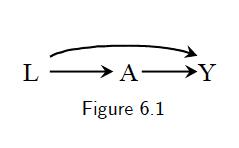

# 6. Graphical representation of causal effects {-}

The use of graphs in causal inference problems makes it easier to follow a sensible advice: draw your assumptions before your conclusions. 

## 6.1 Causal diagrams {-}
<!--

- The presence of an arrow pointing from a particular variable $V$ to another variable $W$ indicates that we know there is a direct causal effect for at least one individual. 

- A standard causal diagram does not distinguish whether an arrow represents a harmful effect or a protective effect. 

-->

### Causal directed acyclic graphs {-}

- We define a DAG $G$ to be a graph whose nodes are random variables $V=(V_1,..., V_M)$ with directed edges and no directed cycles. We use $PA_m$ to denote the parents of $V_m$, i.e., the set of nodes from which there is a direct arrow into $V_m$. The variable $V_m$ is a descendant of $V_j$ if there is a sequence of nodes connected by edges between $V_j$ and $V_m$ such that, following the direction indicated by the arrows, one can reach $V_m$ by starting at $V_j$. We adopt the ordering convention that if $m>j$, $V_m$ is not an ancestor of $V_j$. We define the distribution of $V$ to be Markov with respect to a DAG $G$ if for each $j$, $V_j$ is independent of its non-descendants conditional on its parents.

- A causal DAG is a DAG in which 1) the lack of an arrow from node $V_j$ to $V_m$ can be interpreted as the absence of a direct causal effect of $V_j$ on $V_m$ relative to the other variables on the graph, **2) all common causes, even if unmeasured, of any pair of variables on the graph are themselves on the graph**, and 3) any variable is a cause of its descendants. 

- Causal Markov assumption: conditional on its direct causes, a variable $V_j$ is independent of any variable for which it is not a cause. That is, conditional on its parents, $V_j$ is independent of its non-descendants. Mathematically, it's equivalent to the statement that the density $f(V)$ of the variables $V$ in DAG $G$ satisfies the Markov factorization
   $$ f(v)=\prod_{i=1}^{M}f(v_j|pa_{j}). $$

```{proof}
We want to show the equivalence. We have
$$f(v)=f(v_1)\prod_{i=2}^{M}f(v_j|v_1,..., v_{j-1} ).$$
Based on the Markov assumption and the ordering convention, we have 
$$f(v_j|v_1,..., v_{j-1})=f(v_j|pa_{j}).$$
Therefore, we have $f(v)=\prod_{i=1}^{M}f(v_j|pa_{j})$.   
```


