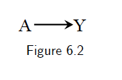
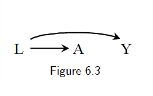

# 6. Graphical representation of causal effects {-}

The use of graphs in causal inference problems makes it easier to follow a sensible advice: draw your assumptions before your conclusions. 

## 6.1 Causal diagrams {-}
<!--

- The presence of an arrow pointing from a particular variable $V$ to another variable $W$ indicates that we know there is a direct causal effect for at least one individual. 

- A standard causal diagram does not distinguish whether an arrow represents a harmful effect or a protective effect. 

-->

### Causal directed acyclic graphs {-}

- We define a DAG $G$ to be a graph whose nodes are random variables $V=(V_1,..., V_M)$ with directed edges and no directed cycles. We use $PA_m$ to denote the parents of $V_m$, i.e., the set of nodes from which there is a direct arrow into $V_m$. The variable $V_m$ is a descendant of $V_j$ if there is a sequence of nodes connected by edges between $V_j$ and $V_m$ such that, following the direction indicated by the arrows, one can reach $V_m$ by starting at $V_j$. We adopt the ordering convention that if $m>j$, $V_m$ is not an ancestor of $V_j$. We define the distribution of $V$ to be Markov with respect to a DAG $G$ if for each $j$, $V_j$ is independent of its non-descendants conditional on its parents.

- A causal DAG is a DAG in which 1) the lack of an arrow from node $V_j$ to $V_m$ can be interpreted as the absence of a direct causal effect of $V_j$ on $V_m$ relative to the other variables on the graph, **2) all common causes, even if unmeasured, of any pair of variables on the graph are themselves on the graph**, and 3) any variable is a cause of its descendants. 

- Causal Markov assumption: conditional on its direct causes, a variable $V_j$ is independent of any variable for which it is not a cause. That is, conditional on its parents, $V_j$ is independent of its non-descendants. Mathematically, it's equivalent to the statement that the density $f(V)$ of the variables $V$ in DAG $G$ satisfies the Markov factorization
   $$ f(v)=\prod_{i=1}^{M}f(v_j|pa_{j}). $$

```{proof}
We want to show the equivalence. We have
$$f(v)=f(v_1)\prod_{i=2}^{M}f(v_j|v_1,..., v_{j-1} ).$$
Based on the Markov assumption and the ordering convention, we have 
$$f(v_j|v_1,..., v_{j-1})=f(v_j|pa_{j}).$$
Therefore, we have $f(v)=\prod_{i=1}^{M}f(v_j|pa_{j})$.   

Theorem 20.3 in the book All of Statistics also has an explanation. 

```


### Examples {-}

- A marginally randomized experiment can be represented by the following causal DAG: 


For example, if we know that aspirin use $A$ has a preventive causal effect on the risk of heart disease $Y$, i.e., $P(Y^{a=1}=1)\ne P(Y^{a=0}=1)$. The causal diagram in Figure 6.2 is the graphical translation of this knowledge for an experiment in which aspirin $A$ is randomly, and unconditionally, assigned. 


- A conditionally randomized experiment can be represented by the following causal DAG:


Note this figure can also represent an observational study. Figure 6.1 represents an observational study in which we are willing to assume that the assignment of $A$ has $L$ as parent and no other causes of $Y$. Otherwise, those causes of $Y$, even if unmeasured, would need to be included in the diagram, as they would be common causes of $A$ and $Y$. 

- Suppose we know that carrying a lighter $A$ has no causal effect on anyone's risk of lung cancer $Y$, i.e., $P(Y^{a=1}=1)=P(Y^{a=0}=1)$, and that cigarette smoking $L$ hs a causal effect on both carrying a lighter $A$ and lung cancer $Y$. The causal diagram in Figure 6.3 is the graphical translation of this knowledge. 




## 6.2 Causal diagrams and marginal independence {-}

- Causal diagrams are a simple way to encode our subject-matter knowledge, and our assumptions, about the qualitative causal structure of a problem. Causal diagrams also encode information about potential associations between the variables in the causal network. It is precisely this simultaneous representation of association and causation that makes causal diagrams such an attractive tool. 


- When one knows that $A$ has a causal effect on $Y$, as in Figure 6.2, then one should also generally expect $A$ and $Y$ to be associated. This is consistenct with the fact that, in an ideal randomized experiment with unconditional exchangeability, causation $P(Y^{a=1}=1)\ne P(Y^{a=0}=1)$ implies association $P(Y=1|A=1)\ne P(Y=1|A=0)$, and vice versa. 

- In Figure 6.3, we have $P(Y^{a=1}=1)=P(Y^{a=0}=1)$. But $P(Y=1|A=1)\ne P(Y=1|A=0)$. See the book for an intuitive explanation. 

- Consider the following causal DAG:

<image src="images/fig6-4.png">

The common effect $L$ is referred to as a collider on the path $A\rightarrow L\leftarrow Y$ because two arrowheads collide on this node. Colliders, unlike other variables, block the flow of association along the path on which they lie. Thus, $A$ and $Y$ are independent because the only path between them, $A\rightarrow L\leftarrow Y$, is blocked by the collider $L$. 

```{proof}
By Markov assumption, we have 
$$ f(a, y, l)=f(a)f(y)f(l|a, y).$$
So 
$$f(a, y)=\int f(a, y, l)dl=\int f(a)f(y)f(l|a, y)dl=f(a)f(y).$$
Therefore, $A$ and $Y$ are independent.   
```

- **In summary, two variables are marginally associated if one causes the other, or if they share common causes. Otherwise they will be marginally independent.**


## 6.3 Causal diagrams and conditional independence {-}

- Consider the following causal DAG:

<image src="images/fig6-5.png">

Question: is there an association between $A$ and $Y$ within levels of (conditional on) $B$? 

Conclusion: Even though $A$ and $Y$ are marginally associated, $A$ and $Y$ are conditionally independent given $B$. Graphically, we say that a box placed around variable $B$ blocks the flow of association through the path $A\rightarrow B\rightarrow Y$.  

```{proof}
By Markov assumption (conditional on its direct causes, a variable $V_j$ is independent of any variable for which it is not a cause), we have $Y$ is independent of $A$ conditional on $B$.  
```


- Consider the following causal DAG:
<image src="images/fig6-6.png">

Question: is $A$ associated with $Y$ conditional on $L$?

Conclusion: $A$ and $Y$ are conditionally independent given $L$. 

```{proof}
By Markov assumption. 

```

- Consider the following causal DAG: 
<image src="images/fig6-6.png">

Question: Is $A$ associated with $Y$ conditional on $L$? 

Conclusion:   


## Appendix A: uncorrelated vs. independent {-}

- Two random variables $X$ and $Y$ are **uncorrelated** when their correlation coefficient is 0: $\rho(X, Y)=0$. 
Being uncorrelated is the same as having zero covariance. If $\rho(X, Y)\ne 0$, then $X$ and $Y$ are correlated. 

- Two random variables are **independent** when their joint probability distribution is the product of their marginal probability distributions: for all $x$ and $y$, 
$$p_{X, Y}(x, y)=p_{X}(x)p_{Y}(y).$$
Equivalently, the conditional distribution is the same as the marginal distribution:
$$p_{Y|X}(y|x)=P_{Y}(y).$$
If $X$ and $Y$ are not independent, then they are **dependent**. 

- If $Y$ is a non-constant function of $X$, then $X$ and $Y$ are always dependent. (Lemma: Let $X$ be a random variable and let $f$ be a Borel measurable function such that $X$ and $f(X)$ are independent. Then $f(X)$ is constant almost surely. That is, there is some $a\in \mathbb{R}$ such that $P(f(X)=a)=1$.)

```{proof}
See https://stats.stackexchange.com/questions/16321/are-the-random-variables-x-and-fx-dependent. 
```


- If $X$ and $Y$ are independent, then they are also uncorrelated. (This also implies that if $X$ and $Y$ are correlated, then they are dependent.)

```{proof}
$E(XY)=\int\int xyp_{X, Y}(x, y)dxdy
= \int\int xyp_{X}(x)p_{Y}(y)dxdy
= \int xp_{X}(x)dx\int yp_{Y}(y)dy
=E(X)E(Y)$
```

- However, if $X$ and $Y$ are uncorrelated, then they can still be dependent. For example, let $Y=X^2$, then if $E(X)=0$ and $E(X^3)=0$, we have $Cov(X, Y)=E(XY)=E(X^3)=0$, so $X$ and $Y$ are uncorrelated, but they are dependent.  

## Appendix B: The flow of association and causation in graphs {-}

### Graph terminology {-}

- If two parents $X$ and $Y$ share some child $Z$, but there is no edge connecting $X$ and $Y$, then $X\rightarrow Z\leftarrow Y$ is known as an **immorality**. 

### Bayesian networks {-}

- Chain rule: $P(x_1, x_2,..., x_n)=P(x_1)\prod_i P(x_i|x_{i-1},...,x_1)$

- Given a probability distribution and a corresponding DAG, we can formalize the specification of independencies with the **local Markov assumption**: **Given its parents in the DAG, a node $X$ is independent of its non-descendants.** 

- A probability distribution is said to be locally Markov with respect to a DAG if they satisfy the local Markov assumption. 

- **Bayesian network factorization**: **Given a probability distribution P and a DAG G, P factorizes according to $G$ if $P(x_1,..., x_n)=\prod_i P(x_i|pa_i)$.**

- Local Markov assumption and Bayesian network factorization are equivalent. 

<!--
```{proof}
- From local Markov assumption to Bayesian network factorization: this is straightforward. 

- From Bayesian network factorization to local Markov assumption: 


```


--> 

- The local Markov assumption only gives us information about the independencies in P that a DAG implies. It does not even tell us that if $X$ and $Y$ are adjacent in the DAGs, then $X$ and $Y$ are dependent. And this additional information is very commonly assumed in causal DAGs.To get the guaranteed dependence between adjacent nodes, we generally assume a slightly stronger assumption than the local Markov assumption, which is called the 
**minimality assumption**: 
   - 1. Local Markov assumption
   - 2. Adjacent nodes in the DAG are dependent 

- Note the second part of minimality assumption is equivalent to the following way: if we were to remove any edges from the DAG, P would not be Markov with respect to the graph with the removed edges. 
  - We show this equivalence by a concrete example: 
<p align="center">
<image src="images/minimality.png">
</p>

(**What does the minimality assumption mean?**)


### Causal graphs {-}

- What is a cause? A variable $X$ is said to be a cause of a variable $Y$ if $Y$ can change in response to changes in $X$. (**This definition implies if $X$ is a cause of $Y$, then $X$ and $Y$ are dependent.**)

- Causal edges assumption: In a directed graph, every parent is a direct cause of all its children. 
(Based on the definition of a cause, this assumption implies that adjacent nodes are dependent.)

### Two-node graphs and graphical building blocks {-}

- Two unconnected nodes

<image src="images/two-unconnected-nodes.png">

The Bayesian network factorization implies the two nodes $X_1$ and $X_2$ are unassociated (independent) in this building block. 


- Two connected nodes 

<image src="images/two-connected-nodes.png">


The causal edges assumption implies $X_1$ and $X_2$ are associated. 


### Chains and forks {-}


